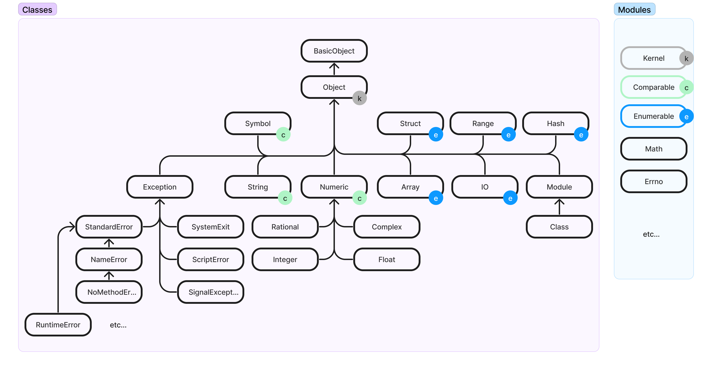

# **Gradually Typing Ruby**

<!--
Hi, I'm Nemo.
Today I'll talk about Gradually Typing Ruby code.
You might ask: Hey, doesn't have Ruby types already? And aren't they all ducks?
What I'll talk about is static typing, as in "compile" time check-able.
Gradually as in: you have some ruby code and you incrementally add type definitions to it.
-->

---

# Why would I want static types in ruby?

<!--
I'll tell you why I want types and how you can do this. I won't talk about general advantages and drawbacks of static typying or compare static to dynamic typing.
There's plenty of material out there and it always depends on your situation - team, project, preference.
-->

---

```shell
cloc --include-lang=ruby .
-------------------------------------------------------------------------------
Language                     files          blank        comment           code
-------------------------------------------------------------------------------
Ruby                         1,954         26,371         15,083        119,623
-------------------------------------------------------------------------------
```

<!--

My situtation:  I'm handling 100k+ LOC of legacy code. 
By "legacy" I mean: "not written by me within the last 3 months".
But It also means
* grown over 10 years
* written by many authors, with differing opinions on design. Most of those authors are no longer around
* varying levels of tests and obseravbility
-->

---

```ruby
def load_and_build_account_signal(account_id)
  # What is account_id?
  


end
```

<!-- 
In that context, I often come across a method like this
I ask myself - what is account_id?
Maybe an integer (DB id)
Maybe a string (uuid etc)
And I'll assume `nil` is a possibility
-->

---

```ruby
def load_and_build_account_signal(account_id)
  # What is account_id?
  if account_id.is_a?(Hash)
    account_id = account_id.dig('account', 'id')
  end
  # so it's nil, string, int or hash... maybe?
end
```

<!-- 
Then I read on and see that...

...dynamic typing FTW!

Unit tests can help here a bit - but they can also be deceiving. Sometimes I find unit tests that only pass integers, but in actual code we support uuids and integer ids.
Other times unit tests pass, but only because some dependency is stubbed out and in a production environment that value fails. We don't have integrated test for all our code (which is a topic for another talk)

So: sometimes I don't know what assumptions I can safely make, within a method/function. I have try to keep all possible states in my mind while changing that code.
-->

---

```ruby
poller.call(opts)
 ↘︎ 
   poll_and_work(opts)
    ↘︎ 
      work_on_task(opts)
       ↘︎ 
         activity_handler.work(opts)
          ↘︎ 
            importer.import_statement(opts)
```

What is in `opts`?

<!--
Or I have to jump up and down the call stack to understand what states I can rule out - to reduce the mental load.

Note that none of this is a stab at developers who came before me. I am certain that everybody had the best intentions writing the code and that they made the best choices they could at the time. Code just has a tendency to sparwl and overgrowth and entangle until it becomes unmanagable. Especially at the low level.
-->

---

<!-- I found existing code to be  -->

🤔 hard to understand
\+
🦶🔫 easy to make mistakes
\+
⚙️ "it's working in production"
\=
😰 scary to make a change

<!-- 
I know that other people in the company feel similarly.
-->

---

# 🎯 Make Code Easy To Change

<!-- 
I asked myself and the team: how we can make our system easier to understand? And easier to change safely.

The idea of static typing has come up before, in  
in 2018 they experimented with Sorbet. At the time they were uncertain about the runtime overhead and they shelved the effort.

With the knowledege that typing is welcome idea and that performance is a critical consideration, I read up on RBS. In our quarterly hack days I prototyped it out and it turned out to be a good fit for us.
-->

---


<!--
So let's get started with typing our existing ruby code!

I'll skip over the basic configuration of steep.

And we'll go right into the demo, starting at the git tag step-1-no-types
-->


<!--
---


[Sorbet](https://sorbet.org/) | [RBS](https://github.com/ruby/rbs)   | [Steep](https://github.com/soutaro/steep)
------ | ------------- | ----
 | ∅ | ∅
By Stripe | By Ruby 3 | By [soutaro](https://github.com/soutaro)
Good docs | Minimal docs | Minimal docs
3.4k ⭐️ | 1.6k ⭐️ | 1.1k ⭐️


-->

---

# Writing Type definitions

<div class="two-columns">
<div>

```ruby
# email_contact.rb

class EmailContact
  attr_accessor :name, :email, :message

  def intialize(name:, email:, message:)
    name = name
    email = email
    message = message
  end

  def deliver
    # imagine the amazing implementation
  end
end
```

</div>

<div>
</div>

</div>


---

# Writing Type definitions

<div class="two-columns">
<div>

```ruby
# email_contact.rb

class EmailContact
  attr_accessor :name, :email, :message

  def intialize(name:, email:, message:)
    name = name
    email = email
    message = message
  end

  def deliver
    # imagine the amazing implementation
  end
end
```

</div>
<div>

```shell
$ bundle exec steep check
# Type checking files:

.............................................F
lib/gradually_typing_ruby.rb:1:6: [warning] 
Cannot find the declaration of class: `EmailContact`
│ Diagnostic ID: Ruby::UnknownConstant
│
└ class EmailContact
        ~~~~~~~~~~~~

Detected 1 problem from 1 file
```

</div>
</div>

---

# Writing Type definitions

<div class="two-columns">
<div>

```ruby
# email_contact.rb

class EmailContact
  attr_accessor :name, :email, :message

  def intialize(name:, email:, message:)
    name = name
    email = email
    message = message
  end

  def deliver
    # imagine
  end
end
```

</div>
<div>

```ruby
# email_contact.rbs                     

class EmailContact
  attr_accessor name: String
  attr_accessor email: String
  attr_accessor message: String

  def initialize: (
    name: String, 
    email: String, 
    message: String
  ) -> void

  def deliver: () -> void
end
```

</div>
</div>

---

✅ Write type definitions
✅ Check types on CLI
✅ VS Code type support


<!-- 
Now we know: 
* how to write type definitions
* how to check our code on the command line
* how to get fast feeback from VS Code
-->

---

# Primer on Ruby StdLib types & RBS

<!-- 
Let's look some basics - the ruby standard library types and what RBS provides out of the box
-->

---




---

# Whirlwind Tour of RBS

```ruby
class Example
                                                                
  
  
  
  
  
  
end
```
---

# Whirlwind Tour of RBS

```ruby
class Example
  @name: String                 # all StdLib types included     
  
  
  
  
  
  
end
```

---

# Whirlwind Tour of RBS

```ruby
class Example
  @name: String                 # all StdLib types included     
  @another_self: Example        # use your own types
  
  
  
  
  
end
```

---

# Whirlwind Tour of RBS

```ruby
class Example
  @name: String                 # all StdLib types included     
  @another_self: Example        # use your own types
  @my_secrets: Array[String]    # generic types
  
  
  
  
end
```

---

# Whirlwind Tour of RBS

```ruby
class Example
  @name: String                 # all StdLib types included     
  @another_self: Example        # use your own types
  @my_secrets: Array[String]    # generic types
  @not_sure: String | Integer   # either a string or an int
  
  
  
end
```

---

# Whirlwind Tour of RBS

```ruby
class Example
  @name: String                 # all StdLib types included     
  @another_self: Example        # use your own types
  @my_secrets: Array[String]    # generic types
  @not_sure: String | Integer   # either a string or an int

  @even_less_sure: String | Integer | Symbol
  
end
```

---

# Whirlwind Tour of RBS

```ruby
class Example
  @name: String                 # all StdLib types included     
  @another_self: Example        # use your own types
  @my_secrets: Array[String]    # generic types
  @not_sure: String | Integer   # either a string or an int
  type myId = String | Integer | Symbol
  @even_less_sure: myId         # type alias
  
end
```

---
# Whirlwind Tour of RBS

```ruby
class Example
  @name: String                 # all StdLib types included     
  @another_self: Example        # use your own types
  @my_secrets: Array[String]    # generic types
  @not_sure: String | Integer   # either a string or an int
  type myId = String | Integer | Symbol
  @even_less_sure: myId         # type alias
  @really_not_sure: untyped     # your get-ouf-of-jail-free card
end
```

---

# Recall earlier...

```ruby
# .rb file
def load_and_build_account_signal(account_id)

# .rbs file
def load_and_build_account_signal(Integer | Hash)                            


```

---

# Recall earlier...

```ruby
# .rb file
def load_and_build_account_signal(account_id)

# rbs file
# def load_and_build_account_signal(Integer | Hash)                             
def load_and_build_account_signal(Integer | Hash[String, Hash])

```

---

# Recall earlier...

```ruby
# .rb file
def load_and_build_account_signal(account_id)

# rbs file
# def load_and_build_account_signal(Integer | Hash)                              
# def load_and_build_account_signal(Integer | Hash[String, Hash])
def load_and_build_account_signal(Integer | Hash[String, Hash[String, Integer]])
```

---

<!-- _color: white -->

# Getting Real - Typing all my code


---

# Getting Real - Typing all my code

`rbs protoype rb`, can also generate from Sorbet's RBI format.

---

# Getting Real - Dependencies & Gems

rbs collections

https://github.com/soutaro/steep/blob/master/guides/src/gem-rbs-collection/gem-rbs-collection.md

---

# Getting Real - But I neeeeeed a 🦆!

---


---